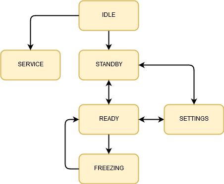

# StatePattern

## General establishment
1. I'm looking for the way to use State Pattern without dynamic memory allocation. It's important for compliance with MISRA standard.
2. State machine should be safe. It can't allow to change state accidentialy. 
3. Usege should be simple and safe. On state change every variable dipendend form current state should be set to safe value.

## Program description
The passes between states are only allowed on way shown on diagram. Other way suitable method from base class (State) is called. For example when we want change state directly from Standby to Freezing then following communicate is displayed: `Illegal state transition from Standby to Freezing`.



Moreover every state has 3 substates:

- `myBegin`
- `myRun`
- `myEnd`

In `myBegin` variables dependend from current state should be initialized and controllers should be started - for example initializing measurment controller. `myBegin` is called once - on the beggining of the state.

In `myRun` should be called functions needed normal working in current state - for example cyclic measurement and sending the values. `myRun` can be called many times belong whole the state lifecycle.

In `myEnd` substate variables should be set to safe velues and controllers should be turn off. `myEnd` is called once - on the end of the state. 


## Console output 

```
Illegal state transition from Idle to Idle
    IdleState.myRun
    IdleState.myEnd
Changing from Idle to Standby state
    StandbyState.myBegin
    StandbyState.myRun
Illegal state transition from Standby to Freezing
    StandbyState.myRun
    StandbyState.myEnd
Changing from Standby to Ready state
    ReadyState.myBegin
    ReadyState.myRun
    ReadyState.myEnd
Changing from Ready to Freezing state
    FreezingState.myBegin
    FreezingState.myRun
```